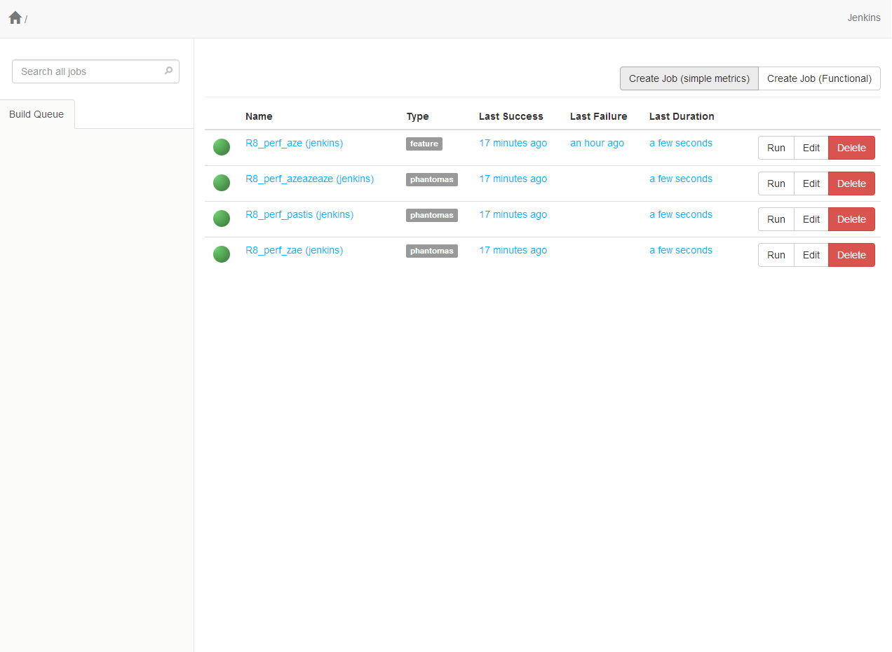
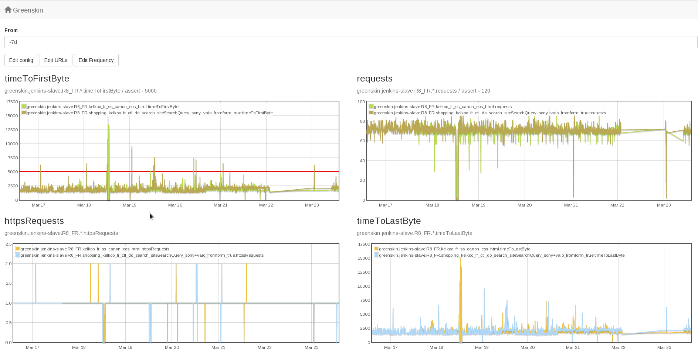
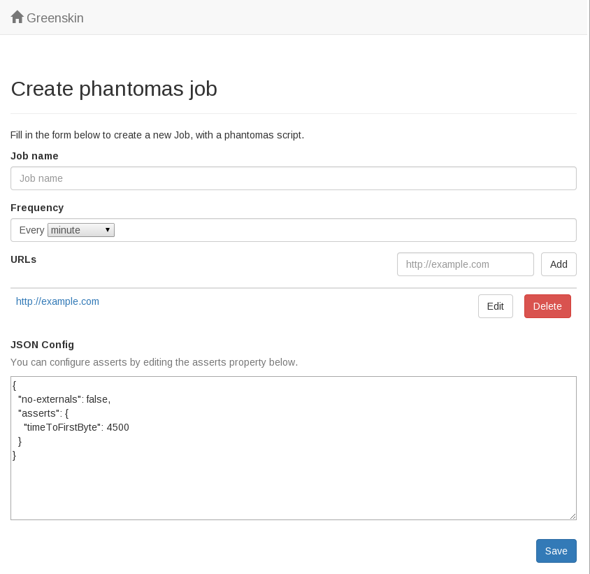

# Greenskin

A little monitoring tool, with a focus on frontend metrics, aiming to provide a
simple way to monitor Frontend Performance.

The project is based on the following systems:

- CI Server - Jenkins
- PhantomJS - For browser automation and collectng metrics
- Phantomas - Monitoring and assertion tools.
- Graphite - For storing metrics.

This is essentially a little angular application on top of Jenkins and
Graphite, with a set of preconfigured jobs (XML templates in
`app/xml/*.xml)`

Greenskin was developped internally at Kelkoo, and they kindly allowed
me to open-source the project.

## How it looks

**Homepage**

A simple list of all monitoring job on Jenkins, with links to build view and Jenkins URLs.

**Job view**

A simple job view to display related graphs from graphite. You can edit
a few job configuration here like URLs, the frequency and most
importantly the phantomas asserts.

**Job creation view**

A simple form to create new Job on Jenkins, using the following XML template (`./xml`).

## Docs

### Get started

The quickest way to get started is to use Vagrant and Ansible to
provision a new VM (or use ansible playbooks without Vagrant).

    # Boot vagrant
    $ vagrant up

This command should start off three VMS, a master, a slave, and
graphite.

- master: Holds Jenkins and the frontend webapp
- slave: Jenkins slave where jobs are running
- graphite: Using https://github.com/dmichel1/ansible-graphite playbook

You'll then need to configure the Jenkins slave manually, for its
credentials. Default is vagrant:vagrant. You can do so by browsing
http://192.168.33.12/jenkins/computer/jenkins-slave/configure

---

If you have Jenkins and Graphite systems already available to you, you
can configure the webapp to use your Jenkins and Graphite hosts.

You'll need however CORS enabled on both systems for it to work
properly.

A sample Apache configuration:

    Access-Control-Allow-Origin: *
    Access-Control-Allow-Methods: POST, GET, OPTIONS, PUT, DELETE
    Access-Control-Allow-Headers: Origin, X-Requested-With, Content-Type, Accept

For Jenkins, you can use https://github.com/jhinrichsen/cors-plugin
plugin if you don't have a frontal HTTP server, with the following options
passed to the java executable that spawns jenkins (in
`/etc/init.d/jenkins`)

    -Dcors.headers="Origin, X-Requested-With, Content-Type, Accept"

Similarly, you'll need to update the `<assignedNode>jenkins-slave</assignedNode>` configuration in each XML job templates `app/xml/*.xml` to match the name of your slave(s) (or remove `<assignedNode />` to make the jobs run on master)

### Config

Application config is stored in the `js/main.js` file, with the
following values:

- jenkinsUrl: Jenkins URL (ex: http://192.168.33.12/jenkins/)
- graphiteUrl: Graphite URL (ex: http://192.168.33.11/)
- baseUrl: Base path of the webapp (ex: /greenskin). If served directly
  from the root of your HTTP server, this would need to be `/`.
- ignoredJobs: List of pattern to ignore when listing jobs from Jenkins.
- mails: List of email address to notify when asserts fail, or for the
  daily / weekly report.
- mailUser: Mail user to use when sending email (see
  https://github.com/andris9/nodemailer-smtp-transport#usage auth user)
- mailHost: SMTP Mail host to use when sending email (see
  https://github.com/andris9/nodemailer-smtp-transport#usage
options.host)
- mailFrom: SMTP Mail from to use when sending email (see
  https://github.com/andris9/Nodemailer#e-mail-message-fields from)

You'll need to run `npm run browserify` whenever you change one of the
config value to rebuild `dist/main.js` file.

### Jenkins

The application needs a Jenkins instance to work with. You can use an
existing Jenkins instance or use a dedicated one.

Then, check that these plugins are installed:

- TAP Plugin (required for test reports)
- Parameterized Trigger Plugin (required for running downstream Jobs)
- [Node label parameter](https://wiki.jenkins-ci.org/display/JENKINS/NodeLabel+Parameter+Plugin) (required for the mailer jobs to use the correct
  slave when several slaves are used)

If you're using Vagrant, the playbooks should have installed them for
you.

### Jenkins Slaves

Though you can run Jobs on master, it is highly recommended to use a
slave for this purpose.

### Jobs

When creating a Job, the following set of downstream Jobs are created:

* mailer - Downstream of any Phantomas Job. Will send emails whenever an
  assert fail.
* mailer-daily - Downstream of any Phantomas Job. Will copy over
  `build.json` file and periodically send an email that sums up the
  state of Phantomas Jobs, with the number of metrics, the number of
  failed metrics and availability (ratio between number of metrics and
  failed ones).
* mailer-weekly - Same as mailer-daily, but the time is set to send
  emails every week.
* cleanup-workspace - Maintenance Job to run once in a while with
  JOB_NAME parameter set to one of the Job to cleanup. It'll removes
  any build dir and metrics older than the parameter NUMBER_OF_BUILDS
