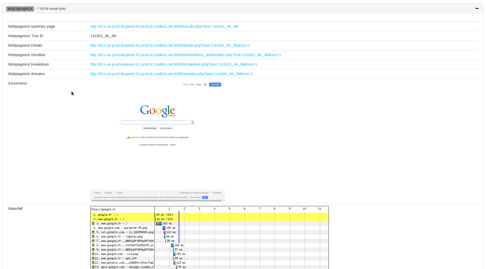

# Greenskin

A set of monitoring tools, with a focus on frontend metrics, aiming to provide a
simple and fun way to monitor Frontend Performance and do functional testing.

The project is based on the following systems:

- Expressjs - To support the frontend webapp
- CI Server - Jenkins
- PhantomJS / Webdriver - For browser automation and collectng metrics
- Phantomas - Monitoring and assertion tools.
- Webpagetest - And a local Chrome agent, driven by Xvfb

The webapp is only one part of the system, we provide ansible playbooks & basic install script for provisioning the main server (required), and (optional) remote slaves.

## Components

Frontend

- bootstrap v3
- CodeMirror
- socket.io
- momentjs
- highcharts
- screenfull.js
- jquery-cron
- jsonlint
- select2
- har-viewer
- ansiparse (with a bit of CSS from travis.org)
- cucumber/gherkin

## Docs

In [docs/](docs/) directory

- [Install "prod"](./docs/install.md) - Documentation on provisioning a
  production server
- [Vagrant](./docs/vagrant.md) - Documentation on setting up a local
  environment using Vagrant.
- [Jenkins Job XML Config](docs/jenkins-config.md) - A description of Job
  XML config, and shared parameters accross Jobs.
- [Jenkins Job Wokspace](docs/jenkins-workspace.md) - A description of
  generated workspace, and shared files accross builds.
- [Subapps](docs/plugins.md) - Extension points and plugin / subapps system.

## How it looks

**Homepage**

A simple list of all monitoring job on Jenkins, with links to build view and Jenkins URLs.

**WebPagetest / Phantomas Job creation**

The process of setting up a phantomas or WebPagetest job requires a Job name, a based frequency (cron), an optional JSON configuration, a list of URLs, and a set of metrics and threshold.

**Graphs from WebPagetest or Phantomas Metrics**

The metrics view on each job provides a graph for each metrics generated by WebPagetest or Phantomas over time.

**Assert edition view**

Another way to further configure thresholds and control the monitored
metrics. You'll get graphs with horizontal red line based on the assert
value you configure. Hit save, and the Job configuration will
be updated accordingly.

**Phantomas Build view**

Phantomas can generate an HAR and a filmstrip, a set of screenshots
rendered at some important event during the page loading. This page aims
to provide a side by side view of both the "timeline" and detailed HAR.

**WebPagetest Build view**

WebPagetest is used to test a set of URLs, and assert the result against
a spec file.

**Functonal feature job creation**

You can add here [Cucumber like scenarios (Gherkin)](https://github.com/cucumber/cucumber/wiki/Gherkin) and view or edit step definitions. The runner relies on Mocha and is executed directly from PhantomJS.

Hitting Ctrl-R will run the test by spawning a PhantomJS instance and report back directly to the UI. A screenshot is generated for every step, and displayed below the editor.

Ctrl-Space can trigger basic autocompletion on registered steps, providing usefull hints on what you can do.

**Step edition**

Steps are written in PhantomJS, and are serialized (along the feature files) as a JSON string in the Jenkins Job XML congiguration (using `JSON_CONFIG` environment variable). You can add new ones, by opening the step edition dialog.

Also, running a step not yet implemented will appear as a pending test. Clicking on the corresponding STDOUT line will generate a basic snippet to get you started. Hit the Save button to persist the change.

**Build history**

A simple list of the last builds for a particular job.

## Docs

### Get started

The quickest way to get started is to use Vagrant and Ansible to
provision a new VM (or use ansible playbooks without Vagrant).

    # Boot vagrant
    $ vagrant up

This command should start off two VMS, a master and a slave.

- master: Holds Jenkins and the node.js application
- slave: Jenkins slave and WebPagetest server and agent

### Jenkins

The application needs a Jenkins instance to work with. You can use an
existing Jenkins instance or use a dedicated one.

To quicly provision a new Jenkins, you can use the
`vms/greenskin-ansible/playbooks/greenskin-master/site.yml` playbook, or use vagrant at the root of the
repo and run `vagrant up gs-master`.

Then, check that these plugins are installed at  http://$hostname/pluginManager/ (where $hostname is the machine FQDN)

- TAP Plugin (required for test reports)
- Parameterized Trigger Plugin (required for running downstream Jobs)

### Jenkins Slaves

Though you can run Jobs on master, it is highly recommended to use a
slave for this purpose.

You can provision a new machine with everything needed by Greenskin
using the
`vms/greenskin-ansible/playbooks/greenskin-slave/site.yml` playbook, or use
vagrant at the root of the repo and run `vagrant up gs-slave`.

Then, you'll need to configure Jenkins to add and connect a new "node"
and configure a new slave:
http://$hostname/jenkins/computer/new

1. Choose a name for the node, like `jenkins-slave`. If not using
   jenkins-slave, you'll need to update every job created to use the
   correct name.
2. Choose "Dumb slave"
3. Click next
4. In "Remote working directory" put the absolute path of this working directory on the slave, like `/var/jenkins` or using Vagrant `/home/vagrant`
5. In "Launch method", choose "Launch slave agents on Unix machines via SSH"
6. Host: The slave hostname, using Vagrant it is `192.168.33.30`
7. Credentials: Configure jenkins to use the correct credentials, either
   name and password, or using a private key file.
8. Click save

You can provision the Jenkins slave by using the
`vms/greenskin-ansible/playbooks/greenskin-jenkins-configure/site.yml`
playbook. It'll install Jenkins plugins like tap and
parameterized-trigger, and configure a new slave named "jenkins-slave".
You'll then only need to configure Credentials accordinly and launch the
slave (for Vagrant - 	Remote root directory: /home/vagrant, user: vagrant, password: vagrant)

### Node app

cd into `s4/` and install dependencies.

    cd s4/
    npm i

    cd ../plugins/phantomas
    npm i

    cd ../../plugins/feature
    npm i

    cd ../../plugins/webpagetest
    npm i

Ensure the Jenkins config in package.json is correct and match the
correct host, here for the vagrant setup with 192.168.33.12:8080/jenkins

    "config": {
      "jenkins": "http://192.168.33.12:8080/jenkins",
      "jenkinsUI": "http://192.168.33.12:8080/jenkins"
    }

Run the app with the following command

    DEBUG=gs* node bin/www

#### First job: Phantomas

Click on the "Create job (simple metrics)" button and fill the form.
Specify a name, and a list of URLs to analyse.

You can verify or edit the JSON configuration passed to Phantomas, and
check the run script as well.

Click save, it should create a new Job in Jenkins that you can run.

Once a build has completed, you should be able to see the list of
Metrics and Asserts by clicking on the corresponding tab. Specify
asserts by clicking on the "Edit" button for each graphs.

#### First job: Webpagetest

Click on the "Create WebPagetest Job (chrome)" button and fill the form.
Specify a name, and a list of URLs to analyse.

You can verify or edit the JSON configuration passed to [webpagetest-api](https://github.com/marcelduran/webpagetest-api), a spec file as documented in the [dedicated page](https://github.com/marcelduran/webpagetest-api/wiki/Test-Specs).

Click save, it should create a new Job in Jenkins that you can run.

Once a build has completed, you should be able to see the list of
Metrics and Asserts by clicking on the corresponding tab. Specify
asserts by clicking on the "Edit" button for each graphs, it'll update
the JSON configuration.

#### First job: Feature

Click on the "Create job (functional)" button and fill the form.
Specify a name, a cron timer and a list of feature file to run.

To add a new feature file, click on the "Create" button. When the focus
is on the feature textarea, you can hit Ctrl-Space to autocomplete based
on the registered steps and hit Ctrl-R to run the current feature. You
should see the test output on the right black box.

### Jobs

When creating a Job, the following set of downstream Jobs are created:

* mailer - Downstream of any Phantomas Job. Will send emails whenever an
  assert fail.
* mailer-daily - Downstream of any Phantomas Job. Will copy over
  `build.json` file and periodically send an email that sums up the
  state of Phantomas Jobs, with the number of metrics, the number of
  failed metrics and availability (ratio between number of metrics and
  failed ones.
* mailer-weekly - Same as mailer-daily, but the time is set to send
  emails every week.
* webdriver-kill - Downstream of any feature Job. Takes care of killing
  PhantomJS webdriver process.
* cleanup-workspace - Maintenance Job to run once in a while with
  JOB_NAME parameter set to one of the Job to cleanup. It'll removes
  any build dir and metrics older than the parameter NUMBER_OF_BUILDS
