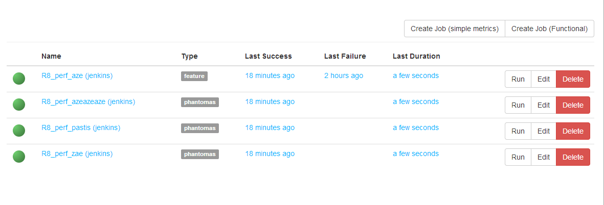
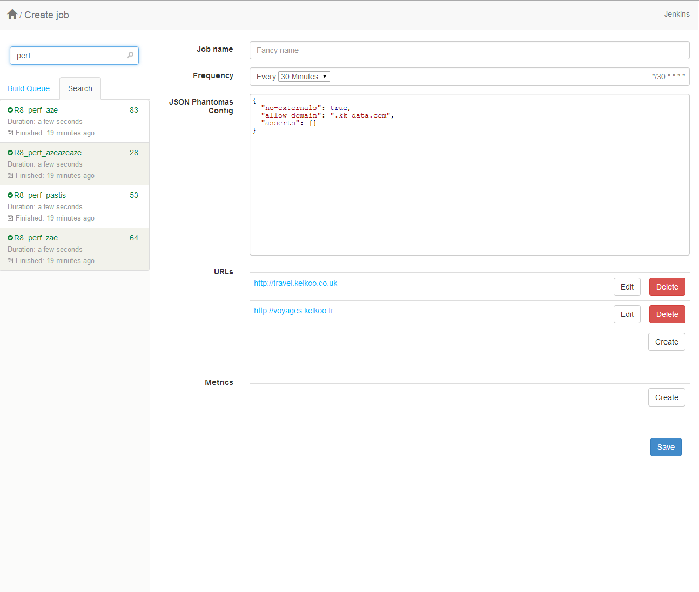
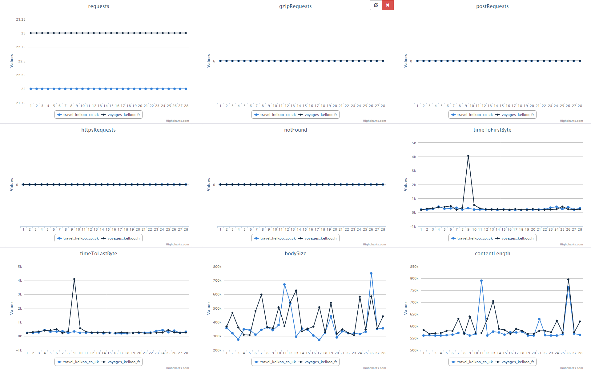
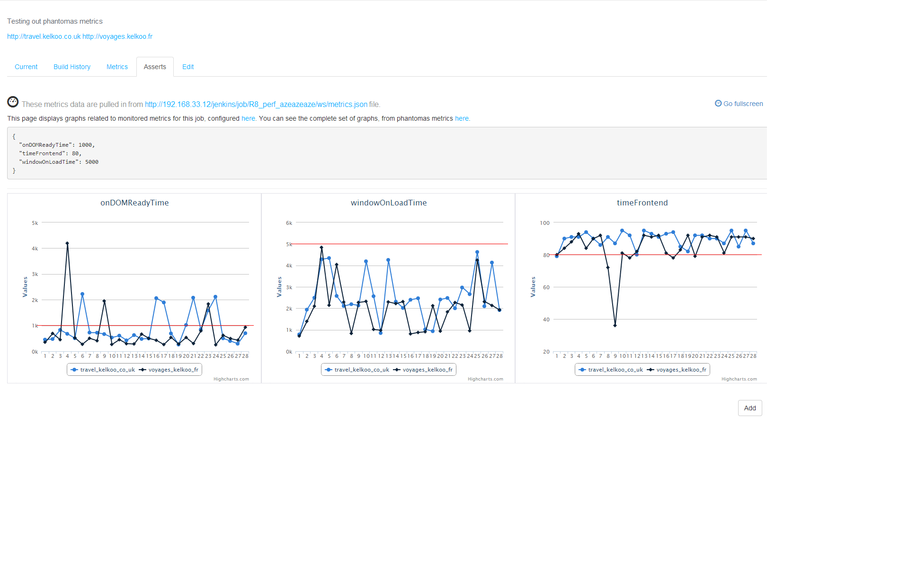
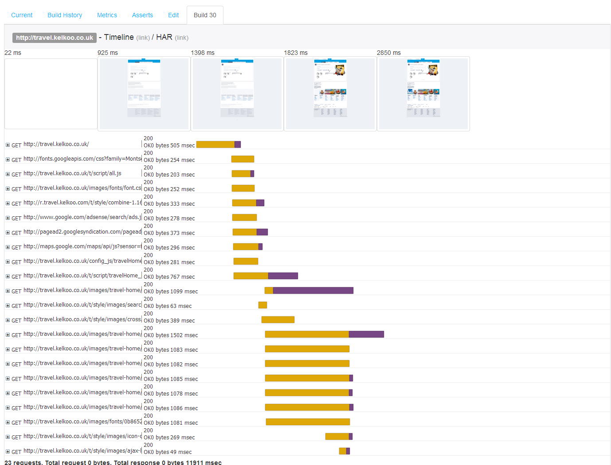
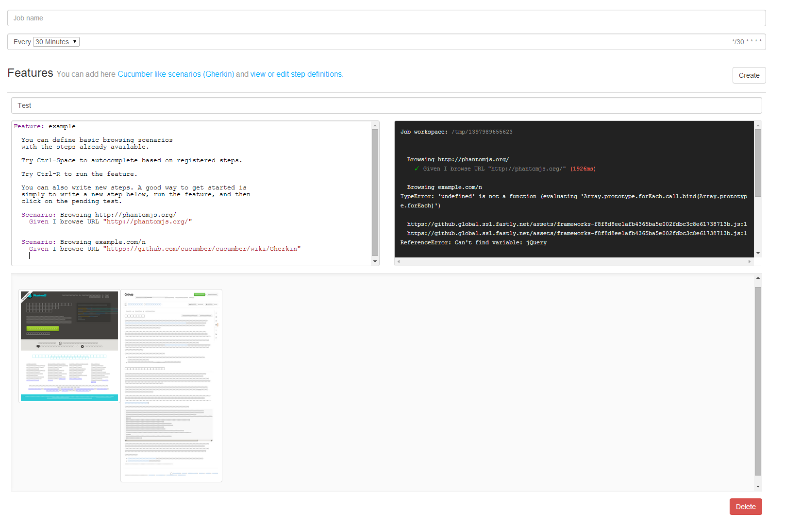
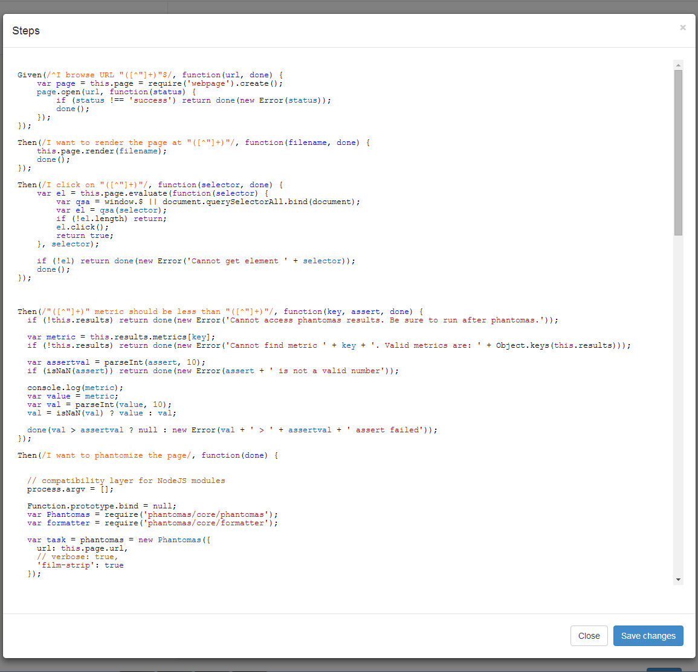
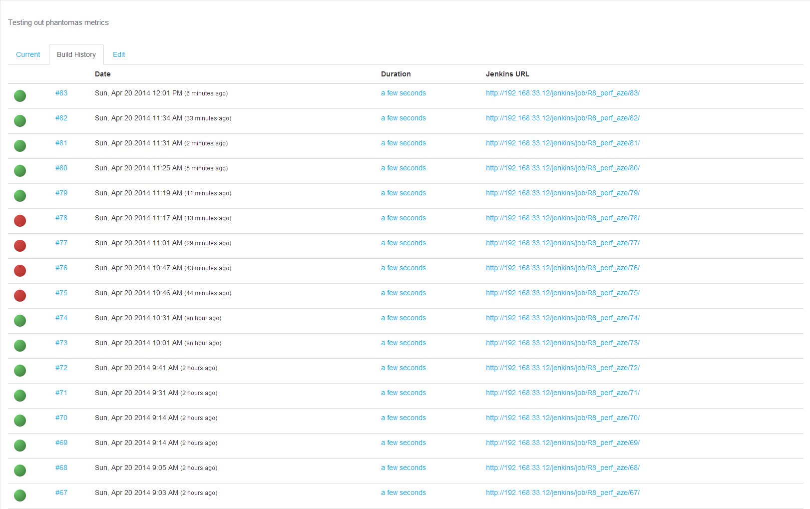
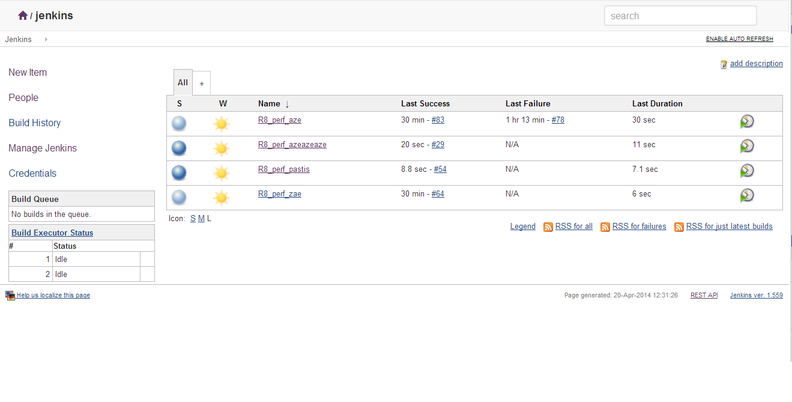

# Greenskin

A set of monitoring tools, with a focus on frontend metrics, aiming to provide a
simple and fun way to monitor Frontend Performance and do functional testing.

The project is based on the following systems:

- Expressjs - To support the frontend webapp
- CI Server - Jenkins, Travis or built-in (based on kue)
- Statsd - with support for backend such as Graphite, Cube or raw git.
- PhantomJS / Webdriver - For browser automation and collectng metrics
- Phantomas / Browsertime - Monitoring and assertion tools.
- VM / Slaves / Saucelabs - Provisioning cookbook and tight integraiton
  to Saucelabs for browser instrumentation

The webapp is only one part of the system, we provide ansible playbooks & basic install script for provisioning the main server (required), and (optional) remote slaves.

## Docs

In [docs/](docs/) directory

- [Install "prod"](./docs/install.md) - Documentation on provisioning a
  production server
- [Vagrant](./docs/vagrant.md) - Documentation on setting up a local
  environment using Vagrant.
- [Jenkins Job XML Config](docs/jenkins-config.md) - A description of Job
  XML config, and shared parameters accross Jobs.
- [Jenkins Job Wokspace](docs/jenkins-workspace.md) - A description of
  generated workspace, and shared files accross builds.
- [Subapps](docs/plugins.md) - Extension points and plugin / subapps system.

## Relates projects

Projects / packages created for Greenskin

- https://github.com/mklabs/propo
- https://github.com/mklabs/jobb
- https://github.com/mklabs/gistmailer
- https://github.com/mklabs/statsd-fs
- https://github.com/mklabs/wd-gherkin
- https://github.com/mklabs/saucelabs-browsertime

All in alpha state, though some have comprehensive test suites.

## How it looks

**Homepage**

A simple list of all monitoring job on Jenkins, with links to build view and Jenkins URLs.

**Phantomas Job creation**

The process of setting up a phantomas job requires a Job name, a based frequency (cron), an optional JSON configuration, a list of URLs, and a set of metrics and threshold.

**Graphs from Phantomas Metrics**

The metrics view on each job provides a graph for each metrics generated by Phantomas over time.

**Assert edition view**

Another way to further configure thresholds and control the monitored metrics. You'll get graphs with horizontal red line based on the assert value you configure. Hit save, and the Phantomas Job configuration will be updated accordingly.

**Build view**

Phantomas can generate an HAR and a filmstrip, a set of screenshots rendered at some important event during the page loading. This page aims to provide a side by side view of both the "timeline" and detailed HAR.

**Functonal feature job creation**

You can add here [Cucumber like scenarios (Gherkin)](https://github.com/cucumber/cucumber/wiki/Gherkin) and view or edit step definitions. The runner relies on Mocha and is executed directly from PhantomJS.

Hitting Ctrl-R will run the test by spawning a PhantomJS instance and report back directly to the UI. A screenshot is generated for every step, and displayed below the editor.

Ctrl-Space can trigger basic autocompletion on registered steps, providing usefull hints on what you can do.

**Step edition**

Steps are written in PhantomJS, and are serialized (along the feature files) as a JSON string in the Jenkins Job XML congiguration (using `JSON_CONFIG` environment variable). You can add new ones, by opening the step edition dialog.

Also, running a step not yet implemented will appear as a pending test. Clicking on the corresponding STDOUT line will generate a basic snippet to get you started. Hit the Save button to persist the change.

**Build history**

A simple list of the last builds for a particular job.

**Custom jenkins theme**

Jenkins is usually available at `/jenkins`. Assuming the Simple Theme Plugin is installed, you can use `/jenkins-theme/main.css` and `/jenkins-theme/main.js` to get a slightly different UI.

(based on [Doony Theme](https://github.com/kevinburke/doony))

## Components

Frontend

- bootstrap v3
- CodeMirror
- socket.io
- momentjs
- highcharts
- screenfull.js
- jquery-cron
- jsonlint
- select2
- har-viewer
- ansiparse (with a bit of CSS from travis.org)
- cucumber/gherkin

## Docs

And global thoughts:

- The webapp & subapps / package works together to provide the UI,
  scripts and libraries to perform a performance / functional test (ex:
  phantomas, browsertime)

- The runner is a CI server, default being Jenkins. Travis integration
  is possible (is it ? can't setup cron, only on post push on a github
  repo) and / or a minimal job runner based on kue.

- Slaves / Test agent: Handled by Jenkins Master / Slave configuration,
  are the VMs provided where the tests are executed. They include xvfb
  and Firefox by default (TODO: check on non-centos system for Chrome &
  Chromedriver provisioning) / (TODO: Check on setting up a Selenium
  server there to, and register to selenium grid)

- Saucelabs: Saucelabs service is an interresting alternative with
  broader browser support eliminating the need of any slaves / test
  agent setup and maintenance.

> TODO: Webdriver integration / Saucelabs

Most of the metrics are gathered by Phantomas, instrumented via Jenkins, from optional remote slaves.

The webapp sits in front of Jenkins to provide a simple UI to create predefined and ready to use Jobs and configuration to gather metrics at a set interval.

Monitoring can consist of simple metrics measurement, or more complex functional scenario. It usually consists in a list of URLs, analyzed at a fixed interval, with a set of measures (or asserts) on metrics that Phantomas provides.

The result is then displayed in a custom frontend dashboard on top of Jenkins, to display and manage graphs and alerting based on those metrics.

Jenkins, on a failing assert, generates an email notification.

## TODOs

- [] Everything
