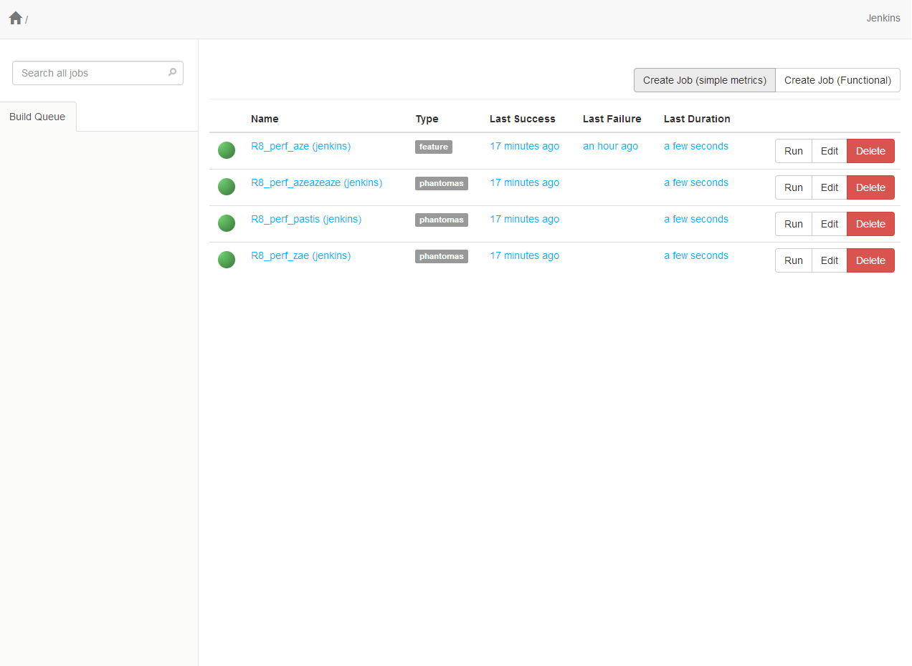
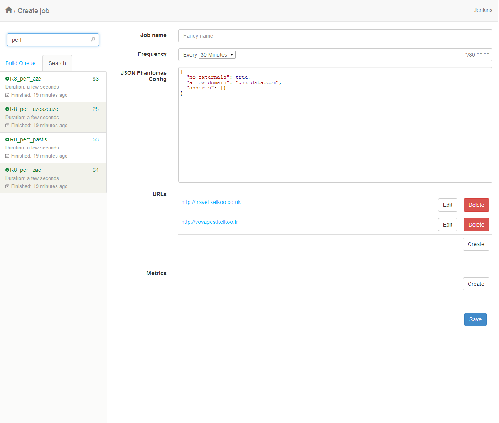
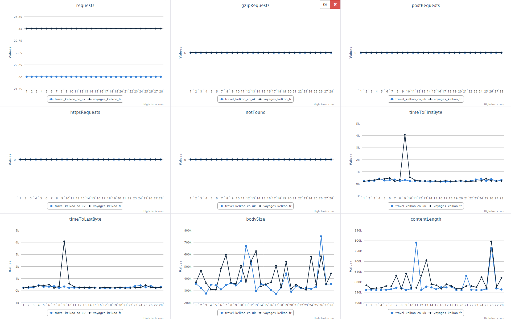
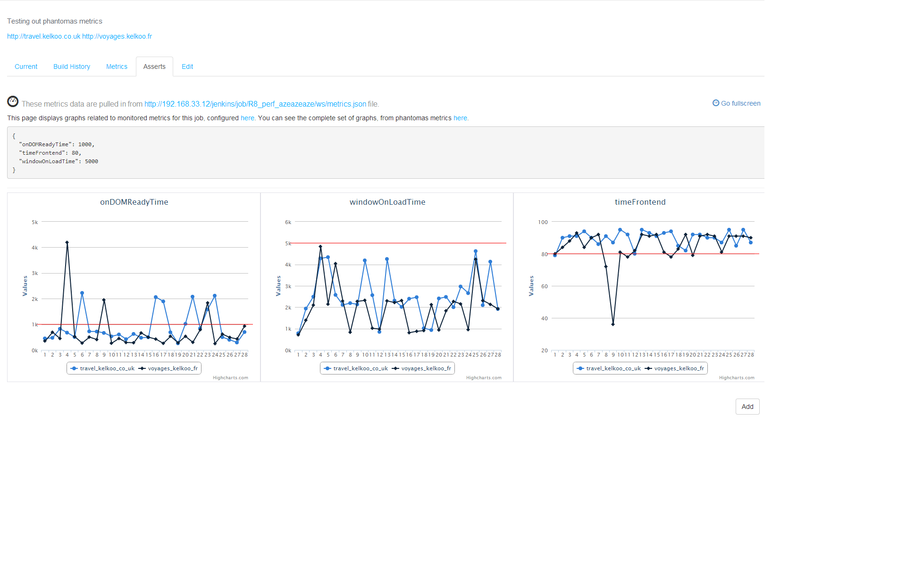
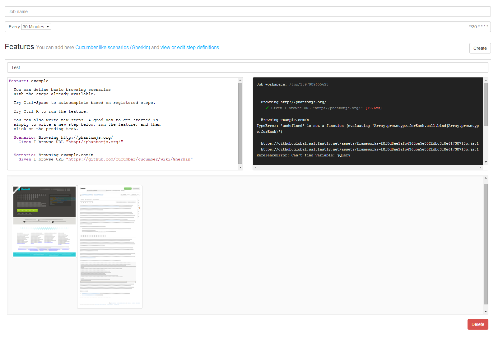
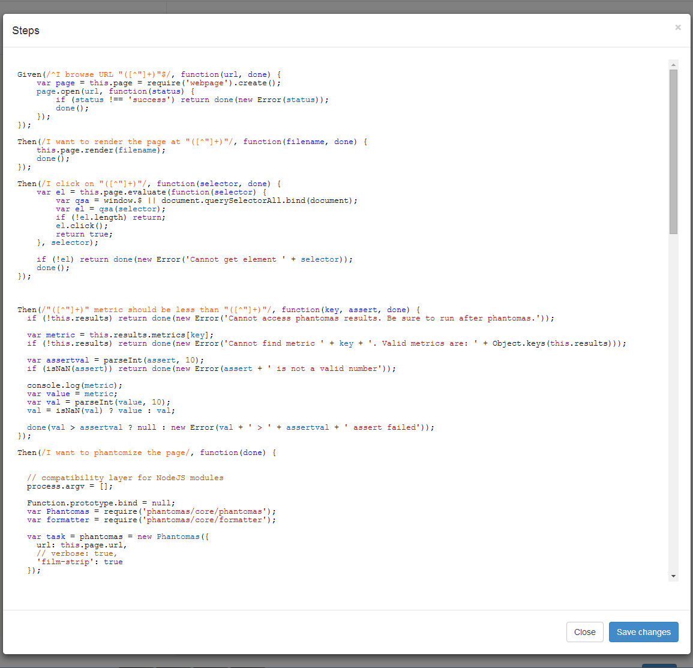
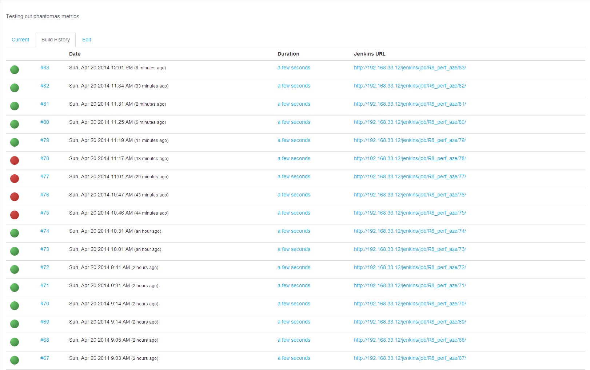
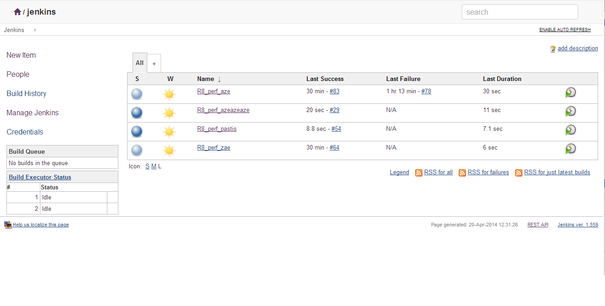

# Hermód

Source : mythologie Nordique, Dieu des messagers, il peut aussi courir beaucoup plus vite que tous les autres dieux Asgardiens, rivalisant avec le mutant Vif-Argent et Hermès le dieu grec. 
An express based webapp, sitting on top of Jenkins, aiming to provide a simple and fun way to monitor Frontend Performance and / or run easy functional testing.

Based on PhantomJS / Phantomas for metrics collection, Mocha / Gherkin for functional tests, Jenkins as a robust Job scheduler with distributed capabilitied (Master / Slave)

The webapp is only one part of the system, we provide ansible playbooks & basic install script for provisioning the main server (required), and optional remote slaves.

Redis is an optional, but recommended, dependency for running Feature through [kue](https://github.com/learnboost/kue) "locally".

## Description

Most of the metrics are gathered by Phantomas, instrumented via Jenkins, from optional remote slaves.

The webapp sits in front of Jenkins to provide a simple UI to create predefined and ready to use Jobs and configuration to gather metrics at a set interval.

Monitoring can consist of simple metrics measurement, or more complex functional scenario. It usually consists in a list of URLs, analyzed at a fixed interval, with a set of measures (or asserts) on metrics that Phantomas provides.

The result is then displayed in a custom frontend dashboard on top of Jenkins, to display and manage graphs and alerting based on those metrics.

Jenkins, on a failing assert, generates an email notification.

## How it looks


**Homepage**

A simple list of all monitoring job on Jenkins, with links to build view and Jenkins URLs.



**Phantomas Job creation**

The process of setting up a phantomas job requires a Job name, a based frequency (cron), an optional JSON configuration, a list of URLs, and a set of metrics and threshold.



**Graphs from Phantomas Metrics**

The metrics view on each job provides a graph for each metrics generated by Phantomas over time.



**Assert edition view**

Another way to futher configure thresholds and control the monitored metrics. You'll get graphs with horizontal red line based on the assert value you configure. Hit save, and the Phantomas Job configuration will be updated accordingly.



**Functonal feature job creation**

You can add here [Cucumber like scenarios (Gherkin)](https://github.com/cucumber/cucumber/wiki/Gherkin) and view or edit step definitions. The runner relies on Mocha and is executed directly from PhantomJS.

Hitting Ctrl-R will run the test by spawning a PhantomJS instance and report back directly to the UI. A screenshot is generated for every step, and displayed below the editor.

Ctrl-Space can trigger basic autocompletion on registered steps, providing usefull hints on what you can do.



**Step edition**

Steps are written in PhantomJS, and are serialized (along the feature files) as a JSON string in the Jenkins Job XML congiguration (using `JSON_CONFIG` environment variable). You can add new ones, by opening the step edition dialog.

Also, running a step not yet implemented will appear as a pending test. Clicking on the corresponding STDOUT line will generate a basic snippet to get you started. Hit the Save button to persist the change.



**Build history**

A simple list of the last builds for a particular job.



**Custom jenkins theme**

Jenkins is usually available at `/jenkins`. Assuming the Simple Theme Plugin is installed, you can use `/jenkins-theme/main.css` and `/jenkins-theme/main.js` to get a slightly different UI.

(based on [Doony Theme](https://github.com/kevinburke/doony))



## Components

Systems

- Expressjs
- Jenkins
- Graphite
- PhantomJS
- Phantomas

Frontend

- bootstrap v3
- CodeMirror
- socket.io
- momentjs
- highcharts
- screenfull.js
- jquery-cron
- jsonlint
- select2
- har-viewer
- ansiparse (with a bit of CSS from travis.org)
- cucumber/gherkin


## Install

The app can work with any Jenkins instance, by using a job prefix to help
isolating job related to the frontend monitoring. Though, we recommend using
the standard configuration below, with a dedicated Jenkins instance.

It will setup a server with Apache, as a reverse proxy, in front of both the node app and Jenkins.

```
/             => node app
/jenkins      => jenkins
```

You can change the Jenkins hostname in `server/package.json` file.

### Jenkins / Node frontend

On the machine hosting Jenkins & the node frontend:


    git clone $repo # where $repo is the Git clone URL of this repo
    cd $repo # where $repo is the project name (cloned directory)

    cd vms/jenkins-master
    sh install.sh

Or simply use vms/jenkins-master/install.sh file as a runbook

Check that these plugins are installed at http://$hostname/jenkins/pluginManager/ (where $hostname is the machine FQDN)

- TAP Plugin (required for test reports)
- Simple Theme Plugin (optional, for theming jenkins)
- jQuery Plugin (optional, for theming jenkins)

**Optional**

Go to http://$hostname/jenkins/configure and add these files to custom CSS / JS

    /jenkins-theme/main.css
    /jenkins-theme/main.js
 
**TODO**

Consider folllowing https://wiki.jenkins-ci.org/display/JENKINS/Securing+Jenkins

### Jenkins Slave

 > TODO: Test and document setup


## Local Dev (with vagrant)

We use Vagrant locally to setup the various part of the system. For now,
you'll need to cd into each repository and `vagrant up` to get started, we'll
rework them into a mutli VM Vagrantfile.

```
Apache proxypass config

/             => node app
/jenkins      => jenkins
```

#### Jenkins / Node app

Using vagrant, and the `jenkins-master` VM.

    vagrant up jenkins-master

Check Jenkins: http://localhost:8082 or http://192.168.33.12:8082
Check nodeapp: http://192.168.33.12 or http://192.168.33.12:3000

Services

    sudo service httpd {start|stop|status}
    sudo service jenkins {start|stop|status}
    sudo service r8_perf {start|stop|status}
  
Logs:

    tail -f /opt/kookel/r8_perf

Check that these plugins are installed at http://192.168.33.12/jenkins/pluginManager/

- Simple Theme Plugin
- jQuery Plugin
- TAP Plugin

#### Jenkins Slave

  vagrant up jenkins-slave

Then create and connect the node to Jenkins master: http://192.168.33.12/jenkins/computer/new

1. Choose a name for the node
2. Choose "Dumb slave"
3. Click next
4. In "Remote working directory" put: /home/vagrant
5. In "Launch method", choose "Launch slave agents on Unix machines via SSH"
6. Host: 192.168.33.30
7. Credentials: vagrant/vagrant
8. Click save